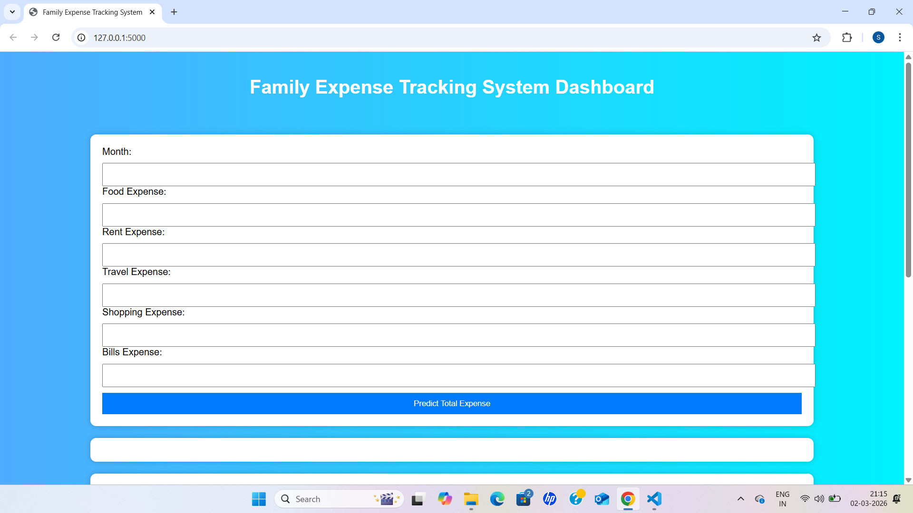
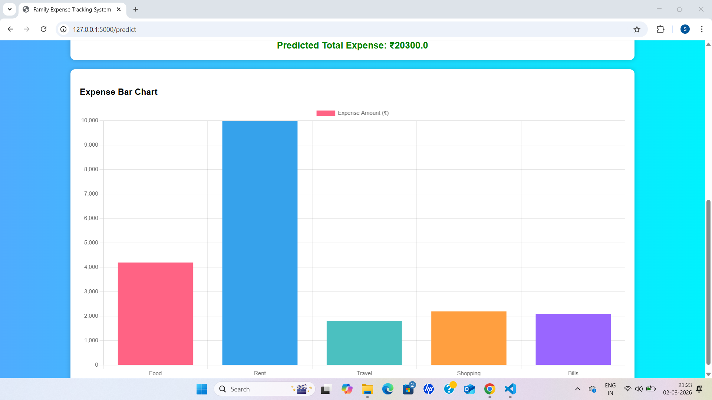
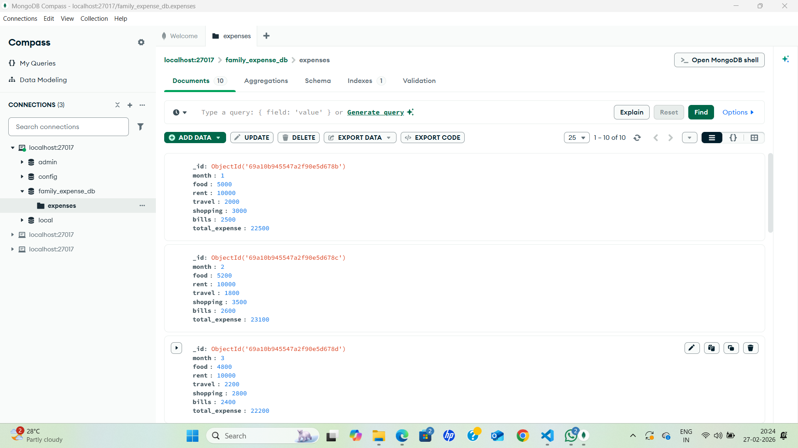

# Family Expense Prediction using Machine Learning

## Project Description
This project predicts family expenses using Machine Learning techniques. It uses historical expense data to train a model and predict future expenses.

## Technologies Used
- Python
- Machine Learning
- Flask
- MongoDB
- HTML
- CSV and JSON

## Project Files
- app.py – Main Flask application
- train_model.py – Machine learning model training
- train_model_mongodb.py – Training using MongoDB data
- ml_model.py – Machine learning logic
- convert_csv_to_json.py – Converts CSV data to JSON
- mongodb_insert.py – Inserts data into MongoDB
- expenses.csv – Dataset
- expenses.json – JSON dataset
- model.pkl – Trained machine learning model
- index.html – Frontend interface
- famlreport1.pdf – Project report

## Output
The system predicts family expenses based on input data using trained ML model.

## Authors
Group Project – Family Expense Prediction ML

## Contributor
Suhani Poojary

---

## 📸 Project Output Screenshots

### 🏠 Home Page

### 📝 Input Form

### 📊 Prediction Result

### 🗄️ MongoDB Stored Data

---
